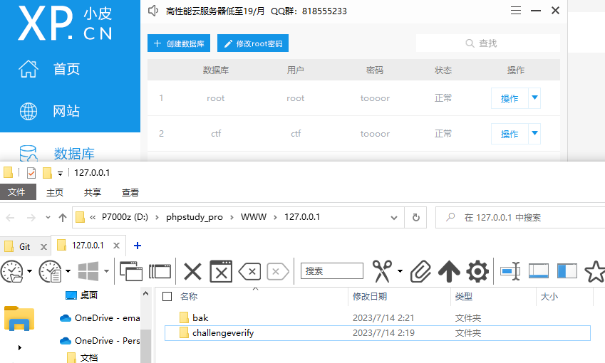
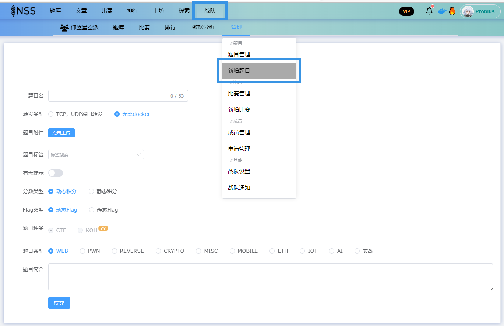

# 如何优雅的出CTF题

本教程基于 [Ctf-Docker-Template](https://github.com/CTF-Archives/ctf-docker-template) 项目地址:https://github.com/CTF-Archives/ctf-docker-template

您可以在这里找到所有所提及的容器模板，有问题请提交issue，当然您有更好的模板，也欢迎提交PR，如果该项目帮助到您，请给个star支持一下\~

!!! warning "注意" 本教程将默认您已经具备以下条件:\
1\. 拥有[Docker环境](../HC\_envSet/docker\_on\_linux.md) 并且 对Docker有一定的了解\
2\. 至少熟悉一个CTF方向，并且清楚CTF题目命题方向

该教程主要针对有容器需求的题目，如PWN 和 WEB 并且普遍利用动态容器技术(即 动态Flag) 除了传统的PWN 和 WEB 需求的动态容器，结合目前CTF其他方向也尝试引入容器提高题目的 质量 趣味 或者 难度？我们也提供诸如nc交互式的Crypto题目容器模板，当然您也可以自行修改模板来适应您的题目需求。

## 动态容器原理

当然这并不很必要太详细的了解，不过为了防止您在使用过程中出现一些问题，我们还是简单的介绍一下动态容器的原理。 CTF比赛中 几乎所有容器的动态Flag 均基于环境变量(environment)实现，在启动中利用类似 `-e FLAG=flag{xxx}` 的方式来设置环境变量。

!!! note "有意思" 在很多容器的本地运行需要注入flag的时候 您可能会看到以下类似的命令 `docker run -dtP -e FLAG=NSSCTF{123456} [imagesName:Tag]`

将flag注入到环境变量中后，通过bash脚本(在项目的靶机模板中我们使用 docker-entrypoint.sh) 直接引用环境变量，将其写入到需要放置flag的文件或者数据库中，当然诸如flask的框架也可以直接在代码中引用环境变量(getenv)。

!!! warning "注意" 编写题目时 您可能会进行类似于 FLAG写入环境变量 使用Bash脚本 使用db.sql文件进行数据库初始化... 请注意在完成对应操作后 非必要情况下请抹除环境变量以及删除对应的脚本文件，防止flag泄露。

## Web题目

### 前置知识

首先您需要清楚目前Web的题目类型 和 其可能会用到的语言技术 / 框架技术，可能会遇到的题目技术栈大概有以下几种:

* PHP 一般容器页面技术为 **Nginx + PHP** | 当然在涉及到数据库交互时 使用 **LNMP (Nginx MySQL PHP)** 容器 | 极其少见的情况下会使用 **Apache + PHP** | 同样的数据库交互时使用 **LAMP (Apache MySQL PHP)** 容器。
* Python 目前大多数Python题目都基于 **Flask** 框架，当然也有少数基于 **Django** 框架的题目。
* Java\
  Java题目除了一般的 **Jar** 包外，还有基于 **SpringBoot** 框架的题目，基于 **Tomcat** 的题目也有。
* Js\
  Js题目一般都是基于 **Node.js** 的，当然也有少数基于 **Express** 框架的题目。

目前我们的容器模板列表(Web)如下:

* web-nginx-php73
* web-nginx-mysql-php73
* web-flask-python\_3.7
* web-flask-python\_3.10
* web-java-jar-openjdk11
* web-tomcat-war-jetty-jdk8 ...我们会持续更新，我们也欢迎您提交PR来帮助我们完善模板

### 编写题目源码

如同现实或者说物理机上的 开发/生产 环境一样，您需要编写对应服务的源码，并将其放置在web服务的工作目录，这样才能运行。 这些操作在容器中也一样，我们推荐您在本地 或者 调试用的虚拟机/容器上 编写好源码后，再将其放置到我们的模板中。

下面我们以编写一道简单的SQL注入题目为例子，介绍以下编写题目源码的步骤。

首先，题目所需要的服务是 PHP 和 MySQL，简单的SQL注入，我们使用单个index.php作为web服务的核心即可，然后用 connect.php 来接入数据库

下面是index.php的源码:

```php

    <?php
        error_reporting(0);
      include "connect.php";
    ?>
    <!DOCTYPE html>
    <html>
    #....省略的HTML代码....
     <?php

     $sql = "SELECT username,password FROM users WHERE id = ".'(((((('.$_GET["id"].'))))))';
     echo "<h5>Executed Operations:</h5>"
         .$sql
         ."<br><br>";
     $result = $conn->query($sql);
     if ($result->num_rows > 0) {
             print_r(mysqli_fetch_all($result, MYSQLI_ASSOC));
     } else {
         echo "0 results";
     }
     ?>
     #....省略的HTML代码....
```

下面是connect.php的源码:

```php
<?php
  $servername = "localhost";
  $username = "root";
  $password = "toooor";
  $dbname = "ctf";

  $conn = new mysqli($servername, $username, $password, $dbname);

  if ($conn->connect_error) {
    die("Connection failed: " . $conn->connect_error);
  }
?>
```

当你编写完题目核心的源码后，你需要在本地验证题目的可行性(至少能跑起来好吧),这里你可以使用小皮面板 或者 Linux上直接部署web环境 亦或者 直接使用我们的模板来验证题目的可行性。

如小皮面板：(注意要和本地环境的账户对齐，当你上传到模板后也需要注意账户问题)



将index.php和connect.php放置到小皮工作目录下(这里我们放在\phpstudy\_pro\WWW\127.0.0.1\challengeverify)，

然后启动apache2 / Nginx 服务，访问 127.0.0.1/challengeverify/


当然在本地出题时 在这一步可能需要做一些调试工作 以及 一些题目的优化工作，这里我们不再赘述。 同时本地的调试 也是题目初步可行性的一种验证，下面您需要将您精心准备的题目转移到我们的模板中(嗯 也就是使用docker封装它)。

### 题目封装

我们已经在模板中帮您完成了大量且意义不大的单调工作，首先您需要将您的题目源码放置到模板的工作目录中，然后便是根据题目修改Dockerfile文件，因为涉及到sql服务 所以这里我们以web-nginx-mysql-php73为例子。 其目录结构如下:

```
+ web-nginx-mysql-php73
    + docker
        - docker-compose.yaml # 该文件用于本地快速部署 简化测试流程
    + service 
        - docker-entrypoint.sh 
    + src
        - index.php
    - Dockerfile
    - db.sql
    - README.md
```

其文件内容如下:

*   Dockerfile的内容如下

    ```Dockerfile
    FROM ctftraining/base_image_nginx_mysql_php_73

    RUN rm -r /var/www/html/index.php && \
        rm -rf /tmp/* && \
        rm -rf /etc/apk 

    COPY ./src/ /var/www/html

    COPY db.sql /var/db.sql

    COPY ./service/docker-entrypoint.sh /docker-entrypoint.sh

    RUN sh -c 'mysqld_safe &' \
    	&& sleep 5s \
        && mysqladmin -uroot password '123456' \ 
        && mysql -e "source /var/db.sql;" -uroot -p123456 \
        && chmod -R 777 /docker-entrypoint.sh \
        && chmod -R 777 /var/db.sql \
        && chown -R www-data:www-data /var/www/html 

    CMD /docker-entrypoint.sh
    ```
*   db.sql的内容如下

    ```sql
    /*
     * db.sql 文件
     *
     * 此文件用于初始化你的 MySQL 数据库。
     * 它将在 Docker 容器启动时运行，
     * 并执行所有的 SQL 命令来设置你的数据库。
     *
     * 你可以在这里创建你的数据库，创建表，
     * 插入数据，或执行任何其他的 SQL 命令。
     *
     * 例如：
     *   CREATE DATABASE IF NOT EXISTS your_database;
     *   USE your_database;
     *   CREATE TABLE your_table (...);
     *   INSERT INTO your_table VALUES (...);
     *
     * 请根据你的需要修改此文件，
     */

    CREATE DATABASE ctf;
    use ctf;
    create table users (id varchar(300),username varchar(300),password varchar(300));
    insert into users values('1','tanji','OHHHHHHH');
    insert into users values('2','fake_flag','F1rst_to_Th3_eggggggggg!} (4/4)');
    ```
*   docker-entrypoint.sh 的内容如下

    ```bash
    #!/bin/bash

    # Get the user
    user=$(ls /home)

    # Check the environment variables for the flag and assign to INSERT_FLAG
    if [ "$DASFLAG" ]; then
        INSERT_FLAG="$DASFLAG"
    elif [ "$FLAG" ]; then
        INSERT_FLAG="$FLAG"
    elif [ "$GZCTF_FLAG" ]; then
        INSERT_FLAG="$GZCTF_FLAG"
    else
        INSERT_FLAG="flag{TEST_Dynamic_FLAG}"
    fi

    # 将FLAG写入文件 请根据需要修改
    echo $INSERT_FLAG | tee /home/$user/flag /flag


    # 将FLAG写入数据库

    if [[ -z $FLAG_COLUMN ]]; then
    	FLAG_COLUMN="flag"
    fi

    if [[ -z $FLAG_TABLE ]]; then
    	FLAG_TABLE="flag"
    fi

    mysql -u root -p123456 -e "USE ctftraining;
    ALTER TABLE FLAG_TABLE CHANGE FLAG_COLUMN $FLAG_COLUMN CHAR(128) NOT NULL DEFAULT 'not_flag';
    ALTER TABLE FLAG_TABLE RENAME $FLAG_TABLE;
    INSERT INTO $INSERT_FLAG VALUES('$INSERT_FLAG');"

    exec "$@"
    ```

    而您需要清楚的是:
* src目录下的文件会被复制到容器的Web服务工作目录(/var/www/html)中，所以您需要把您的题目源码放置到src目录下
* Dockerfile 中大部分内容无需修改，您只需要关心 `mysqladmin -uroot password '123456'`这一步是在设置mysql密码，请注意这里的密码最好不要使用默认弱口令，当然同时也要注意密码要与您的源码中的密码对齐，否则会导致数据库连接失败。
* `mysql -e "source /var/db.sql;"` 这一步是在利用db.sql文件(默认为空)初始化数据库，您需要将您的数据库初始化脚本放置到db.sql中，我们强烈不推荐您在这里直接写入sql语句。
* 最后动态flag的初始化在 docker-entrypoint.sh 文件中完成，如果您在初始化数据库的时候修改了密码 请在该部分同步修改

!!! warning "警告" 除非您知道您在做什么，否则不要随意修改该部分所提到能够修改内容以外的所以代码，否则可能会导致题目无法正常运行。

### 镜像推送

按照对应步骤修改完Dockerfile后，您需要在该模板的根目录下执行以下命令来构建本地镜像:

```bash
docker build -t imagesName:Tag .
```

一般我们需要将镜像推送至dockerhub，这样我们才能在比赛中使用。

```bash
docker tag imagesName:Tag dockerhubUserName/imagesName:Tag
docker push dockerhubUserName/imagesName:Tag
```

当然您也可以在构建的时候直接指定dockerhub的用户名和镜像名，这样就不需要再次打tag了。

```bash
docker build -t dockerhubUserName/imagesName:Tag .
docker push dockerhubUserName/imagesName:Tag
```

### 题目部署

下面我们以NSSCTF平台为例，介绍如何在平台上部署一个动态容器的题目。

!!! warning "注意" 同样，在这里，我们默认您:\
拥有NSSCTF平台账号，并且您拥有您团队的管理资格，如果有疑问可以阅读[NSS平台使用指南](../HC\_Appendix/nssctf\_usage.md).

在战队标签中 点击 **我的战队** 在管理标签处悬停，选择 **新增题目** 即可看到如下界面。



**您需要注意的地方 已在图中标出:** 

对于本Demo题目，我们填写的内容如下:

* 题目名称: ez\_SQL
* 题目描述: 很基础的SQL注入，就是括号有点多(Flag位于数据库中)
* 转发端口: 80
* 镜像名称: probius/litctf2023:Web\_SQL 如果您打包时的镜像名为: `dockerhubUserName/imagesName:Tag` 那么这里就填写 `dockerhubUserName/imagesName:Tag` 以本镜像为例 我们打包使用的指令为 `docker build -t probius/litctf2023:Web_SQL .` 所以这里填写 `probius/litctf2023:Web_SQL`
* Flag类型: 动态Flag

至此，便完成了Web题目命题的几乎所有流程，当然在编写文档时我们省略了一些无关紧要的步骤，如果您有疑问，可以在下面的评论区提出，或者提交issue，如果您对镜像模板有使用上的问题，或者您想要帮助我们完善模板，欢迎在项目[Ctf-Docker-Template](https://github.com/CTF-Archives/ctf-docker-template) 【https://github.com/CTF-Archives/ctf-docker-template】中提交issue或者PR。

## PWN题目

### 前置知识

### 编写题目源码/编译二进制文件

### 题目封装

### 镜像推送

(该部分参考Web部分的镜像推送 我们不再赘述)

## 基于Python的NC题目
